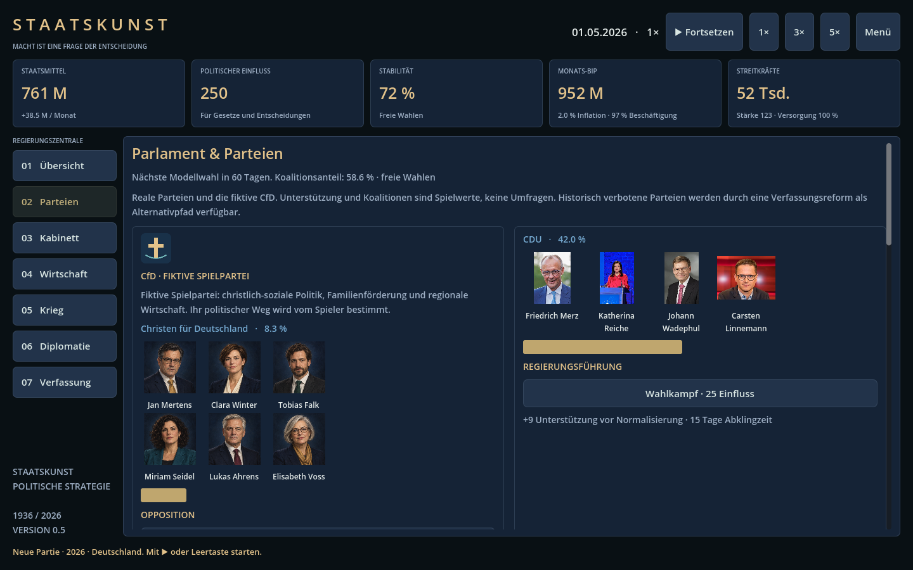
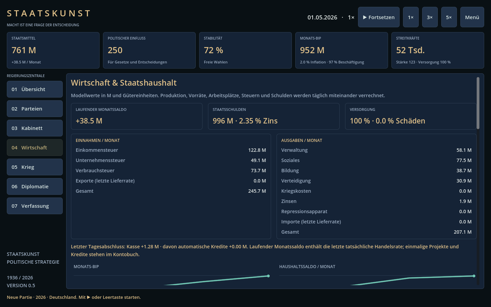
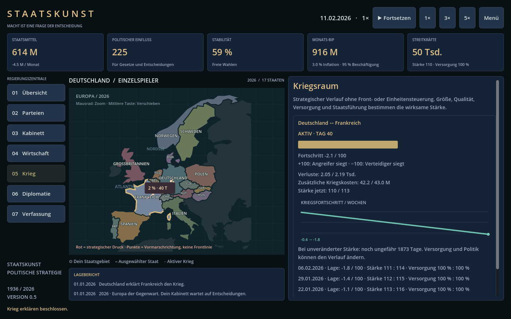

# Staatskunst

Ein politisches Strategiespiel in **Godot 4.5.1**. Regiere einen realen europäischen Staat im Szenario **1936** oder **2026**: Parteien, Koalitionen, eigene Minister, Wirtschaftsaufbau und Diplomatie stehen im Mittelpunkt. Armeen kämpfen automatisch über Zeit, ohne Einheitenbefehle oder Frontverwaltung.

**Version 0.5.0 — spielbarer Prototyp.** Deutsche Oberfläche, Einzelspieler gegen einfache KI sowie LAN / direkte IP mit bis zu acht Spielern. Keine zentralen Server, keine Konten. Eigener Code und eigene Oberfläche, keine übernommenen Hearts-of-Iron-Assets.

[Windows-Download und Quellcode](https://github.com/badcookie-hd/staatskunst/releases/tag/v0.5.0) · [Quellen](docs/SOURCES.md) · [Prüfungen](docs/VALIDATION.md)

Neu in 0.5: **Bilder für alle 314 unterschiedlichen Personen** der enthaltenen Parteien und Staatsämter: 307 Wikimedia-Fotos, eine gekennzeichnete KI-Illustration für Manuel Giménez Fernández sowie sechs erfundene CfD-Politiker. Parteikarten mit Namen unter jedem Bild, bebilderte Ministerauswahl und anklickbare Großansichten mit Bildnachweisen. Alles funktioniert offline. [Bildquellen und Lizenzen](docs/PORTRAIT-CREDITS.md).



## Spielen

Unter Releases **Staatskunst-Windows.zip** herunterladen, vollständig entpacken und **Staatskunst.exe** starten. Windows x64 / OpenGL 3.3; Godot ist zum Spielen nicht erforderlich. Der Export ist nicht digital signiert.

Für Entwicklung: Repository klonen, `project.godot` in Godot 4.5.1 öffnen und F5 drücken. Keine weiteren Pakete nötig.

1. Epoche und Staat wählen. Die Zeit beginnt pausiert.
2. Unter **Parteien** Wahlkampf führen und eine Koalition bilden.
3. Unter **Kabinett** vier Ministerämter mit realen Politikern besetzen.
4. Unter **Wirtschaft** Haushalt, Vorräte und Projekte abstimmen.
5. **Fortsetzen** oder Leertaste startet die Zeit; 1×, 3× und 5× sind verfügbar.
6. Einen Staat auf der Karte wählen und **Diplomatie** öffnen. Im **Krieg**-Bereich erscheinen laufende und abgeschlossene Kriegsberichte.

## Zwei Epochen

| | 1936 | 2026 |
|---|---|---|
| Start | 1. Januar 1936 | 1. Januar 2026 |
| Staaten | 16 | 17 |
| Deutschland | Deutsches Reich; schematische Grenzen einschließlich Ostpreußen | Deutschland |
| Mitteleuropa | Eigenständiges Österreich und Tschechoslowakei | Österreich, Tschechien und Slowakei |
| Politik | Demokratien und autoritäre Regime; verbotene Parteien als demokratischer Alternativpfad | Reale Parteien und Politiker zum Szenariostart; zusätzliche fiktive CfD |
| Deutsche christliche Parteien | Zentrum; fiktive CfD nach Verfassungsreform | CDU, CSU und fiktive CfD |

In beiden Epochen: Deutschland, Frankreich, Vereinigtes Königreich, Italien, Spanien, Polen, Österreich, Tschechoslowakei/Tschechien, Ungarn, Belgien, Niederlande, Schweiz, Portugal, Dänemark, Schweden und Norwegen. 2026 kommt die Slowakei hinzu. Die Karte ist ein **europäischer Ausschnitt**, keine vollständige Weltkarte. Graue Gebiete sind Hintergrund. Mausrad: Zoom; mittlere Maustaste: Verschieben.

Identitäten beziehen sich auf den 1. Januar der jeweiligen Epoche. Der spätere Verlauf ist frei: historische Amtswechsel, Sterbedaten, laufende reale Kriege und Kolonien sind nicht geskriptet. Grenzen sind schematisch. Wirtschaft, Militär, Parteianteile, Koalitionen und Fachprofile sind vereinfachte Spielwerte; keine aktuellen Umfragen oder amtlichen Wirtschaftsstatistiken.

## Parteien und Staatsführung

118 Partei- und parteilose Kandidatenlisten einschließlich zweier fiktiver CfD-Listen über beide Epochen ersetzen die früheren vier generischen Lager. Staatsoberhaupt und Regierungschef haben eigene Namen und Amtstitel, beispielsweise Bundespräsident, Bundeskanzler, König oder Reichsverweser. Die Diplomatie zeigt auch die Staatsführung anderer Länder.

Wahlkampf kostet 25 Einfluss und erhöht einen Parteianteil um neun Punkte vor Normalisierung. Alle Anteile ergeben 100 %. Eine Kampagne ist alle 15 Tage möglich. Modellwahlen finden alle 180 Tage statt: Die stärkste Partei führt eine automatisch zusammengestellte Mehrheitskoalition. Das ist eine einheitliche Spielregel, keine Nachbildung aller nationalen Wahlgesetze.

Koalitionswechsel kosten 30 Einfluss und haben 15 Tage Abklingzeit. Mit einer Mehrheit über 50 % und 80 Einfluss lässt sich eine andere Koalitionspartei mit der Regierungsführung beauftragen. Deren erster Kandidat übernimmt das Regierungsamt. Ein getrenntes Staatsoberhaupt bleibt im Amt. Die Schweiz ist ebenfalls auf dieses Spielmodell vereinfacht.

In autoritären Staaten schaltet eine demokratische Verfassung für 180 M, 120 Einfluss und acht Stabilität freie Parteien und Wahlen frei. Im deutschen 1936-Alternativpfad wird Paul Löbe Übergangspräsident. Danach kann Wilhelm II. für 200 M und 200 Einfluss als konstitutioneller Kaiser zurückgerufen werden; dies kostet zwölf Stabilität. Diese Entwicklungen sind ausdrücklich Alternativgeschichte.

## Eigenes Kabinett

Vier Ressorts: Finanzen, Wirtschaft & Energie, Verteidigung und Auswärtiges Amt. Kandidaten kommen aus den Koalitionsparteien. Ernennung: 20 Einfluss, 15 Tage Abklingzeit je Ressort. Eine Person hat höchstens ein Amt. Ein Koalitionsaustritt räumt die Ministerämter dieser Partei; freie Ämter geben keinen Bonus. Ein Regierungswechsel besetzt das Kabinett neu.

Passendes Spielprofil gibt +12 %, ein anderes Profil +4 %: Steuereffizienz, Wirtschaftsleistung, effektive Armeestärke oder Wirkung von Staatsbesuchen. Das Profil ist eine Spielrolle und bewertet keine realen Fähigkeiten. Die vier Ministerämter bilden ein verkleinertes Spielkabinett. Bei einer Neubildung werden Kandidaten der Regierungspartei und passende Spielprofile bevorzugt. In Deutschland starten sie mit den entsprechenden Ressortinhabern der Epoche; andernorts erfolgt eine vereinfachte Besetzung aus dem Kandidatenpool, gegebenenfalls mit Vakanzen.

## Wirtschaft



Die Wirtschaft verbindet Industrie, Energie, Landwirtschaft, Dienstleistungen, Arbeitskräfte und Produktivität. Kapazitäten erzeugen Güter. Energie, Nahrung und Material werden täglich verbraucht. Vorräte überbrücken Engpässe; danach deckt die laufende Produktion den Bedarf nur anteilig. Mangel senkt Wirtschaftsleistung und Armeestärke. Kriegsschäden senken die Produktion und werden im Frieden langsam repariert.

Der Haushalt zeigt Einkommensteuer, Unternehmenssteuer, Verbrauchsteuer sowie tatsächliche Handelsraten getrennt. Ein Kontobuch protokolliert Tagesabschlüsse, Projekte und Kredite. Ausgaben umfassen Verwaltung, Soziales, Bildung, Verteidigung, Kriegskosten, Schuldzinsen und gegebenenfalls Repressionskosten. Sozialausgaben wirken auf Stabilität, Bildung auf langfristige Produktivität und das Verteidigungsbudget auf Armeestärke und Unterhalt. Beschäftigung folgt den verfügbaren Arbeitsplätzen; Knappheit und Krieg treiben die Modellinflation. Geldbeträge in M sind gemeinsame Recheneinheiten, keine nationalen Währungen.

Fehlbeträge werden bis zum Kreditlimit automatisch finanziert. Staatsanleihen erhöhen Kasse und Schulden um jeweils 200 M; Tilgung senkt beide um 200 M. Das Limit beträgt 150 % des Modell-Jahres-BIP. Zinssatz und Zinslast steigen mit Verschuldung und Inflation. Ist das Kreditlimit ausgeschöpft, senkt Zahlungsunfähigkeit Stabilität und Armee. Monatsverläufe zeigen BIP und Haushaltssaldo.

| Projekt | Kosten | Dauer | Wirkung |
|---|---|---|---|
| Industrie | 180 M / 2026: 220 M + 35 Einfluss | 45 Tage | +8 Industrie |
| Energie, Landwirtschaft oder Dienstleistungen | 160 M + 30 Einfluss | 45 Tage | +12 Kapazität |
| Modernisierung | 140 M / 2026: 180 M + 30 Einfluss | 60 Tage | +0,25 Qualität, maximal 3 |
| Rekrutierung | 90 M / 2026: 110 M + 20 Einfluss | 30 Tage | +15 Tsd. Soldaten |

Höchstens zwei Projekte gleichzeitig. Die Projektkosten werden sofort bezahlt. Das Modell abstrahiert Baumaterialkosten in den Geldkosten.

Handelsverträge importieren bis zu zehn Gütereinheiten pro Monat. Energie kostet 1 M, Nahrung 0,8 M, Material 1,4 M je Einheit. Verkäufer erhalten die tatsächliche Zahlung und verlieren die gelieferten Vorräte. Ohne Überschüsse oder Geld findet keine Lieferung statt. Krieg unterbricht den Handel; Eingliederung beendet betroffene Verträge. Maximal vier Importverträge, Abschlusskosten jeweils 50 M und 25 Einfluss. Importe und Exporte fließen mit der letzten tatsächlichen Lieferrate in den laufenden Haushalt ein. Eigene Verträge sind kündbar. Preise sind in dieser Version fest, ohne Weltmarkt oder Wechselkurse.

## Automatische Kriege



Effektive Stärke = Armeegröße × Qualität × Stabilitätsfaktor × Versorgung × Verteidigungsbudgetfaktor × Ministerfaktor. Der tägliche Fortschritt entspricht viermal der Stärkedifferenz geteilt durch die Summe beider Stärken. Bei +100 gewinnt der Angreifer, bei −100 der Verteidiger. Eine überlegene Armee gewinnt über Zeit, sofern ihr Vorteil bestehen bleibt; bei Gleichstand entsteht ein Patt.

Der Kriegsraum zeigt Verlauf, Verluste, laufende Stärke, kumulierte Zusatzkosten, wöchentliche Lageberichte und eine Schätzung der Restdauer bei unveränderten Kräften. Die Karte zeigt Vormarschrichtung und strategischen Druck. Dies sind keine taktischen Frontlinien. Verluste betragen ungefähr 0,06–0,14 % der Armee täglich, abhängig vom Kräfteverhältnis. Zusätzlicher Monatsunterhalt je Staat: 24 M plus 0,15 M je Tsd. Soldaten. Hinzu kommen Produktionsschäden und Stabilitätsverlust.

Kriege erfordern eine gemeinsame Grenze oder einen im Szenario festgelegten Seezugang. Ein Staat führt höchstens einen Krieg gleichzeitig. Nach 30 Tagen und bei Fortschritt zwischen −45 und +45 ist ein Waffenstillstand für 30 Einfluss möglich; er gilt 180 Tage. Der Sieger übernimmt die Gebiete des Verlierers und 35 % seiner Industrie. Berichte bleiben im Kriegsarchiv erhalten.

Siegbedingung: fünf kontrollierte Länder oder ab Tag 365 mindestens 100 Industrie und 75 % Stabilität. Ein Modellmonat hat 30 Tage, ein Jahr 360 Tage. Alle 75 Tage entsteht eine Kabinettsvorlage mit zwei Antwortmöglichkeiten. Die einfache KI investiert periodisch, reagiert auf Versorgungslücken und stabilisiert ihren Staat; autoritäre KI-Staaten können ab Tag 240 bei deutlicher Überlegenheit Krieg beginnen.

## LAN und Portweiterleitung

1. Alle verwenden dieselbe Spielversion.
2. Der Host wählt einen Staat und öffnet **Menü → LAN / Direkte IP → Aktuelle Partie hosten**.
3. Im LAN geben Gäste die lokale IPv4-Adresse des Hosts ein, beispielsweise `192.168.1.20`.
4. Über das Internet leitet der Host **UDP 24560** im Router an den Spielrechner weiter. Gäste geben dessen öffentliche IP-Adresse ein. Die Windows-Firewall muss die Verbindung erlauben. Bei CGNAT oder fehlendem Routerzugriff ist klassische Portweiterleitung gegebenenfalls nicht möglich.
5. Gäste erhalten automatisch den nächsten freien unabhängigen Staat. Der Host steuert Pause und Geschwindigkeit; die restlichen Staaten spielt die KI.

Die Partie kann bereits laufen, wenn Gäste beitreten. Getrennte Gaststaaten übernimmt die KI. Wenn der Host die Verbindung beendet, pausiert die letzte empfangene Welt beim Gast; sie kann als Einzelspieler weitergespielt oder gespeichert werden. Es gibt keine automatische Hostmigration oder feste Wiederzuordnung eines zurückkehrenden Spielers. Nach einer Trennung wird beim erneuten Beitritt wieder der nächste freie Staat vergeben.

Der Host prüft Befehle, Ressourcen, Zielstaat und Spielerzuordnung. Clients dürfen keine fremden Staaten steuern oder den Simulationsstand schreiben. Dies ist ein Spiel für vertraute LAN-/Direktverbindungen; es gibt keine Benutzeranmeldung und keine verschlüsselte Transportverbindung. Router- und Firewall-Einstellungen werden nicht automatisch verändert.

Netzwerktechnik: [offizielle Godot-Dokumentation](https://docs.godotengine.org/en/4.5/tutorials/networking/high_level_multiplayer.html).


## Speichern

Menü → Partie speichern. Ein manueller Speicherplatz: `user://campaign-v4.json`, unter Windows normalerweise im Godot-Benutzerdatenordner unter AppData. Gespeichert werden Epoche, Kabinett, Koalitionen, Wirtschaftsverläufe, Verträge und Kriegsarchive. Ältere Spielstände sind nicht kompatibel und bleiben in ihren bisherigen Dateien erhalten. Im Netzwerk speichert nur der Host; Laden und Neustart erfordern das Trennen der Sitzung. Eine gespeicherte Welt kann erneut gehostet werden, wobei Gaststaaten neu zugewiesen werden.

## Projektstruktur

- `scripts/simulation.gd`: Aktionen, Wahlen, KI, Handel, Krieg, Spielstände.
- `scripts/politics.gd` und `data/politics.json`: reale Identitäten und Kabinettsregeln.
- `scripts/economy.gd`: Produktion, Vorräte, Haushalt, Schulden, Beschäftigung.
- `scripts/session.gd`: autoritative ENet-Verbindungen.
- `scripts/main.gd`, `world_map.gd`, `trend.gd`: Oberfläche, Karte, Diagramme.
- `tools/build_politics.mjs` und `tools/build_maps.mjs`: reproduzierbare Datengenerierung.
- `tests/`: Simulations-, Oberflächen- und Netzwerkprüfungen.

## Prüfen und exportieren

```sh
godot --headless --path . --editor --import --quit
godot --headless --path . --script res://tests/simulation_test.gd
godot --headless --path . --script res://tests/ui_test.gd
godot --headless --path . --script res://tests/update_test.gd
```

Den Netzwerktest in zwei **gleichzeitig laufenden Terminals** starten, zuerst den Server, direkt danach den Client:

```sh
godot --headless --path . --script res://tests/network_test.gd -- --server
godot --headless --path . --script res://tests/network_test.gd -- --client
```

Der Server läuft acht Sekunden, der Client ungefähr sechs. Für 2026 bei beiden Aufrufen `--modern` anhängen. UDP 24560 muss frei sein. Für Screenshots den UI-Test mit Rendering ausführen und `-- --screenshots` anhängen.

Die offiziellen Exportvorlagen für Godot 4.5.1 installieren, dann:

```sh
mkdir -p build
godot --headless --path . --export-release "Windows Desktop" build/Staatskunst.exe
```

Die CI führt Simulation und UI in Godot aus und prüft beide Epochen mit zwei Netzwerkprozessen. Prüfungen der Version 0.5.0: siehe [VALIDATION.md](docs/VALIDATION.md).


## Grenzen des Prototyps

Ausgewählte europäische Staaten, kuratierte Parteiauswahl, vereinfachte Kabinette und ein einheitliches Wahlsystem. Noch keine vollständige Weltkampagne, Fokusbäume, Koalitionsverhandlungen mit eigener KI, diplomatischen Bündniskriege, dynamischen Weltmarktpreise, Audio oder Reconnect-Identitäten. Die Wirtschaft ist kausal verknüpft, aber keine wissenschaftlich kalibrierte Volkswirtschaftssimulation. Die Balance bleibt ein Spielentwurf.

## Lizenz

Eigener Code und eigene historische Kartenanpassungen: [MIT](LICENSE). Natural-Earth-Geodaten: Public Domain. Godot: MIT, mit Lizenzinformationen im Windows-Paket. Politikerfotos behalten ihre jeweiligen Lizenzen; sie fallen nicht unter die MIT-Lizenz des Codes. [Vollständige Bildnachweise](docs/PORTRAIT-CREDITS.md). CfD-Emblem, Parlamentsillustration und generierte Porträts: [Bilder und Prompts](docs/ART.md). [Quellen und Datenmodell](docs/SOURCES.md).
