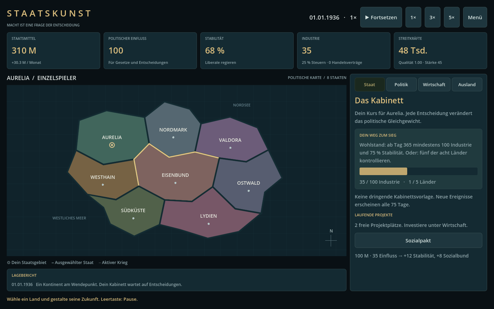

# Staatskunst

Ein eigenständiges politisches Strategiespiel in **Godot 4.5.1**. Führe einen von acht fiktiven Staaten ab 1936: Parteien fördern, Wahlen gewinnen, Wirtschaft ausbauen und außenpolitische Entscheidungen treffen. Kriege werden über die relative Gesamtstärke automatisch über Zeit entschieden.

**Version 0.1.0 — spielbarer Prototyp.** Deutsche Oberfläche, Einzelspieler gegen einfache KI und direkte ENet-Verbindungen für bis zu acht Spieler. Keine Fronten, Einheitenbefehle, Einkesselungen oder getrennte Marine- und Luftkämpfe. Keine zentralen Server oder Spielerkonten. Eigenständige Namen, Karte und Gestaltung; keine übernommenen Assets aus Hearts of Iron.



## Sofort spielen

Unter **[Releases](../../releases)** die Datei `Staatskunst-Windows.zip` herunterladen, vollständig entpacken und `Staatskunst.exe` starten. Windows x64 mit OpenGL 3.3 wird benötigt. Das Programm ist nicht digital signiert. Godot muss zum Spielen des Exports nicht installiert sein.

Für die Entwicklung: Repository klonen, `project.godot` in Godot 4.5.1 öffnen und **F6/F5** bzw. „Projekt ausführen“ verwenden. Es gibt keine externen Pakete oder kostenpflichtigen Dienste.

## Die erste Partie

1. Im Startfenster einen Staat auswählen. Die Zeit beginnt pausiert.
2. Unter **Wirtschaft** Industrie ausbauen. Höchstens zwei Projekte können gleichzeitig laufen.
3. **Fortsetzen** oder **Leertaste** drücken. Bei 1× dauert ein Spieltag eine Sekunde; 3× und 5× beschleunigen.
4. Unter **Politik** Wahlkampf für eine Partei machen. Alle 180 Tage übernimmt die stärkste Partei die Regierung.
5. Auf der Karte einen anderen Staat anklicken und unter **Ausland** Handel, Staatsbesuche oder Krieg wählen.
6. Im **Staat**-Reiter Kabinettsereignisse entscheiden und die Siegziele verfolgen.

Eine Kampagne wird gewonnen durch **fünf kontrollierte Länder** oder **ab Tag 365 mindestens 100 Industrie und 75 % Stabilität**. Ein verlorener Krieg gliedert den gesamten Staat beim Sieger ein; danach ist Beobachten oder ein Neustart möglich. Ein Modellmonat hat 30 Tage, ein Modelljahr 360 Tage.

## Politik und Wirtschaft

| Partei | Regierungswirkung |
|---|---|
| Liberale | Monatliches Zusatzeinkommen: 16 % des Industriewerts |
| Sozialbund | +0,035 Stabilität pro Tag, 6 M Kosten pro Monat |
| Konservative | +0,25 Einfluss pro Tag |
| Nationalblock | +0,025 Tsd. Soldaten pro Tag, −0,02 Stabilität pro Tag |

Wahlkampf kostet 25 Einfluss und erhöht den Anteil einer Partei um 9 Punkte vor Normalisierung. Andere Parteien verlieren Anteile. Alle Parteien zusammen haben immer 100 %. Eine gemeinsame Abklingzeit verhindert sofortige Kampagnenketten.

Industrie, Steuern, Stabilität, Handel, Gebietsbesitz, Regierung und militärischer Unterhalt bestimmen den Haushalt. Der angezeigte Monatssaldo wird täglich zu einem Dreißigstel abgerechnet. Bei Zahlungsunfähigkeit sinken Armeegröße und Stabilität. Hohe Steuern und Krieg drücken die Stabilität; Sozialpolitik kann sie wiederherstellen.

| Projekt | Kosten | Dauer | Ergebnis |
|---|---|---|---|
| Industrie | 180 M + 35 Einfluss | 45 Tage | +8 Industrie |
| Modernisierung | 140 M + 30 Einfluss | 60 Tage | +0,25 Qualität, maximal 3 |
| Rekrutierung | 90 M + 20 Einfluss | 30 Tage | +15 Tsd. Soldaten |

Alle 75 Tage entsteht eine von drei Kabinettsvorlagen. Nach 30 Tagen ohne Auswahl wird die Entscheidung vertagt: +20 Einfluss und −5 Stabilität. In dieser ersten Version teilen die drei Vorlagen dieselben zwei wirtschaftlichen Antwortmöglichkeiten.

## Automatische Kriege

```
Stärke = Armeegröße × Qualität × (0,6 + Stabilität / 200)
Täglicher Fortschritt = 4 × (Angreiferstärke − Verteidigerstärke)
                           / (Angreiferstärke + Verteidigerstärke)
```

Bei +100 gewinnt der Angreifer, bei −100 der Verteidiger. Eine stärkere Armee gewinnt über Zeit, solange ihr Vorteil bestehen bleibt. Politik, Aufrüstung und Zahlungsunfähigkeit können den Vorteil während des Krieges verändern. Bei gleich starken Armeen entsteht eine Pattsituation. Täglich verlieren beide Seiten 0,1 % ihrer Soldaten; Armeegröße fällt dabei nicht unter 5 Tsd. Jeder Krieg kostet zusätzlich 24 M pro Monat und senkt die Stabilität.

Nur benachbarte Staaten können einander angreifen. Jeder Staat führt höchstens einen Krieg gleichzeitig. Nach mindestens 30 Tagen und bei Fortschritt zwischen −45 und +45 kann für 30 Einfluss ein beiderseitig bindender, 180 Tage dauernder Waffenstillstand geschlossen werden. Der Sieger übernimmt alle Gebiete des Verlierers sowie 35 % dessen Industrie; die Eingliederung kostet Stabilität.

## LAN und Portweiterleitung

1. Alle verwenden dieselbe Spielversion.
2. Der Host wählt einen Staat und öffnet **Menü → LAN / Direkte IP → Aktuelle Partie hosten**.
3. Im LAN geben Gäste die lokale IPv4-Adresse des Hosts ein, beispielsweise `192.168.1.20`.
4. Über das Internet leitet der Host **UDP 24560** im Router an den Spielrechner weiter. Gäste geben dessen öffentliche IP-Adresse ein. Die Windows-Firewall muss die Verbindung erlauben. Bei CGNAT oder fehlendem Routerzugriff ist klassische Portweiterleitung gegebenenfalls nicht möglich.
5. Gäste erhalten automatisch den nächsten freien unabhängigen Staat. Der Host steuert Pause und Geschwindigkeit; die restlichen Staaten spielt die KI.

Die Partie kann bereits laufen, wenn Gäste beitreten. Getrennte Gaststaaten übernimmt die KI. Wenn der Host die Verbindung beendet, pausiert die letzte empfangene Welt beim Gast; sie kann als Einzelspieler weitergespielt oder gespeichert werden. Es gibt keine automatische Hostmigration oder feste Wiederzuordnung eines zurückkehrenden Spielers. Nach einer Trennung wird beim erneuten Beitritt wieder der nächste freie Staat vergeben.

Der Host prüft Befehle, Ressourcen, Zielstaat und Spielerzuordnung. Clients dürfen keine fremden Staaten steuern oder den Simulationsstand schreiben. Dies ist ein Spiel für vertraute LAN-/Direktverbindungen; es gibt keine Benutzeranmeldung und keine verschlüsselte Transportverbindung. Router- und Firewall-Einstellungen werden nicht automatisch verändert.

Netzwerktechnik: [offizielle Godot-Dokumentation](https://docs.godotengine.org/en/4.5/tutorials/networking/high_level_multiplayer.html).

## Speichern

**Menü → Partie speichern** schreibt einen lokalen JSON-Spielstand in Godots Benutzerdatenordner, unter Windows normalerweise `%APPDATA%/Godot/app_userdata/Staatskunst/campaign.json`. Es gibt einen manuellen Speicherplatz. Im Netzwerk speichert nur der Host. Laden und Neustart sind während einer Netzwerkpartie deaktiviert; zuerst die Sitzung trennen. Gespeicherte Multiplayer-Welten können als Einzelspieler geladen und anschließend erneut gehostet werden, die Spielerzuordnungen werden neu vergeben.

## Projektstruktur

- `scripts/simulation.gd`: Regeln, KI, Wahlen, Wirtschaft, Kriege, Save-Validierung.
- `scripts/session.gd`: lokale Sitzung und serverautorisierte ENet-RPCs.
- `scripts/world_map.gd`: eigene Vektorkarte mit Länderwahl.
- `scripts/main.gd`: Godot-Control-Oberfläche und Menüs.
- `tests/`: Simulation, UI und zwei reale Netzwerkprozesse.

## Prüfen und exportieren

```sh
godot --headless --path . --editor --import --quit
godot --headless --path . --script res://tests/simulation_test.gd
godot --headless --path . --script res://tests/ui_test.gd
```

Den Netzwerktest in zwei **gleichzeitig laufenden Terminals** starten, zuerst den Server, direkt danach den Client:

```sh
godot --headless --path . --script res://tests/network_test.gd -- --server
godot --headless --path . --script res://tests/network_test.gd -- --client
```

Der Server läuft acht Sekunden, der Client vier. UDP 24560 muss dafür frei sein. Für Screenshots den UI-Test mit Rendering ausführen und `-- --screenshots` anhängen.

Die offiziellen Exportvorlagen für Godot 4.5.1 installieren, dann:

```sh
mkdir -p build
godot --headless --path . --export-release "Windows Desktop" build/Staatskunst.exe
```

Die CI führt Simulation und UI in Godot aus und prüft zwei Netzwerkprozesse. Prüfungen der Version 0.1.0: siehe [VALIDATION.md](docs/VALIDATION.md).

## Umfang dieser Version

Enthalten sind acht fiktive Länder, vier Parteien, Regierungswechsel, Haushalte, drei Bauprojekte, vier Handelsplätze, diplomatische Beziehungen, Kabinettsereignisse, einfache KI, Sieg/Niederlage, manuelles Speichern und direkte Netzwerkpartien. Die KI baut periodisch Projekte; nationalistische KI-Regierungen können bei deutlicher Überlegenheit nach Tag 240 Kriege beginnen.

Noch nicht enthalten: historische Weltkarte, Fokusbäume, komplexe Koalitionen, Produktionsketten, Bündniskriege, Audio, KI-Verhandlungsmodelle, Kampagneneditor und Reconnect-Identitäten. Die Balance ist ein erster spielbarer Entwurf.

## Lizenz

Eigener Spielcode und eigene Grafiken: [MIT](LICENSE). Godot wird separat unter MIT lizenziert; die Windows-Distribution enthält die zugehörigen Lizenzinformationen.
