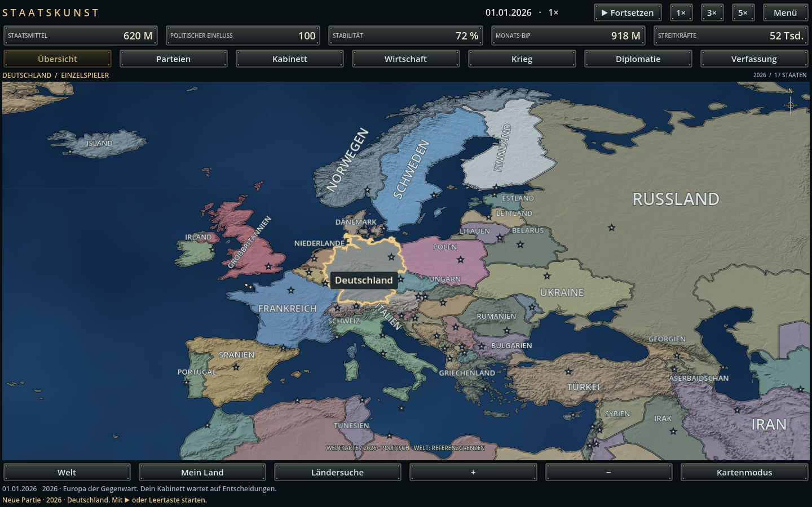
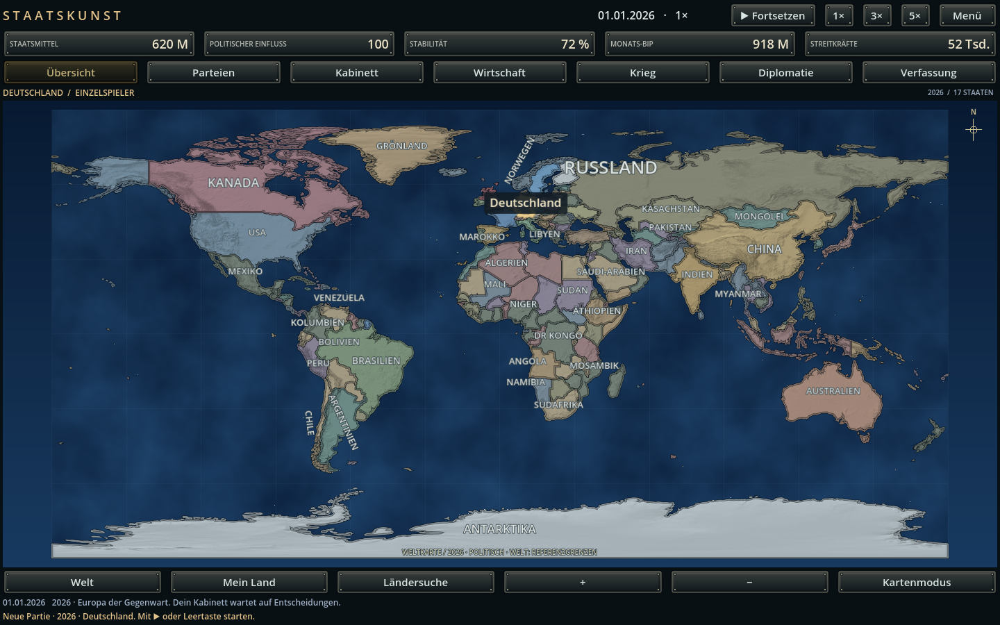
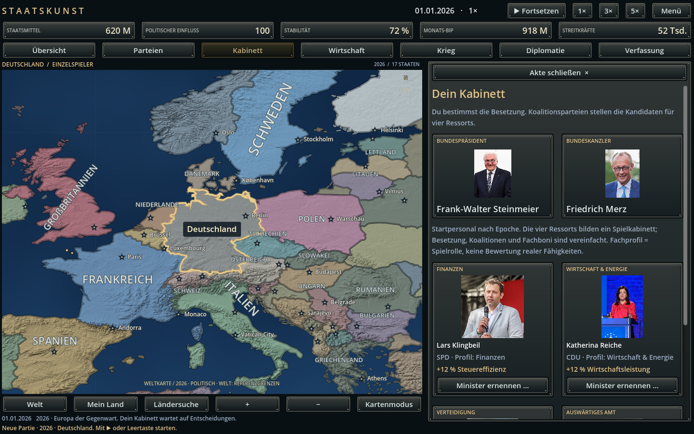

# Karte und Oberfläche, Version 0.8

Die Kartenansicht kombiniert eigene politische Farben und eine eigene Metalloberfläche mit geografischen Daten. Relief, Küsten, Auswahl, Hauptstadtmarkierungen und Beschriftung werden getrennt gezeichnet. Screenshots anderer Spiele dienten als Stilreferenz; es wurden keine Texturen, Symbole oder Oberflächenelemente daraus übernommen.

- Relief: [Natural Earth Shaded Relief](https://www.naturalearthdata.com/downloads/10m-raster-data/10m-shaded-relief/), SR_HR 3.2.0, aus SRTM Plus abgeleitete Schattierung. [Originalarchiv](https://naturalearth.s3.amazonaws.com/10m_raster/SR_HR.zip). Public Domain gemäß [Natural Earth Nutzungsbedingungen](https://www.naturalearthdata.com/about/terms-of-use/).
- `tools/build_relief.py` verkleinert den globalen Rasterdatensatz auf 10800 × 5400 und passt den Grauwertkontrast an. UV-Koordinaten ordnen jeder Landesfläche das tatsächliche Gelände zu. Mipmaps glätten die Weltansicht. Das Relief ist eine vorgerenderte Schattierung, kein begehbares 3D-Gelände.
- Hauptstadtpunkte: [Natural Earth Populated Places](https://github.com/nvkelso/natural-earth-vector/blob/master/geojson/ne_10m_populated_places_simple.geojson), 200 als `adm0cap` markierte Orte. Das ist eine kartografische Referenz, keine unabhängig geprüfte Liste aller Regierungssitze zum Szenariodatum. Im Szenario 1936 werden nur Hauptstadtpunkte der europäischen Kampagnenländer angezeigt. Es werden keine heutigen außereuropäischen Hauptstädte als historische behauptet.
- Grenzen weiterhin Natural Earth 1:50m; historische Grenzanpassungen bleiben schematisch. Weltatlas, Staatsämter und spielbare Länder behalten ihren bisherigen Umfang.
- Metallrahmen: eigenes SVG mit Verlauf, Lichtkanten und Nieten. Meer: reproduzierbares prozedurales Rauschen, keine gemessene Meerestiefe. Länderfarben sind rein gestalterisch.
- Beschriftungen passen Größe und teilweise Ausrichtung dem Land an. Kollisionen zwischen Ländernamen und Ortsnamen werden vermieden; bei Platzmangel erscheinen weitere Namen erst beim Zoomen. Lange Kabinettsnamen werden umgebrochen.

## Reproduzieren

```sh
python tools/build_relief.py /path/to/SR_HR.tif
node tools/build_capitals.mjs /path/to/ne_10m_populated_places_simple.geojson
```

Für die Rasterverarbeitung wird Pillow benötigt. Alle erzeugten Daten und Texturen liegen dem Spiel bei; beim Spielen wird nichts heruntergeladen.




