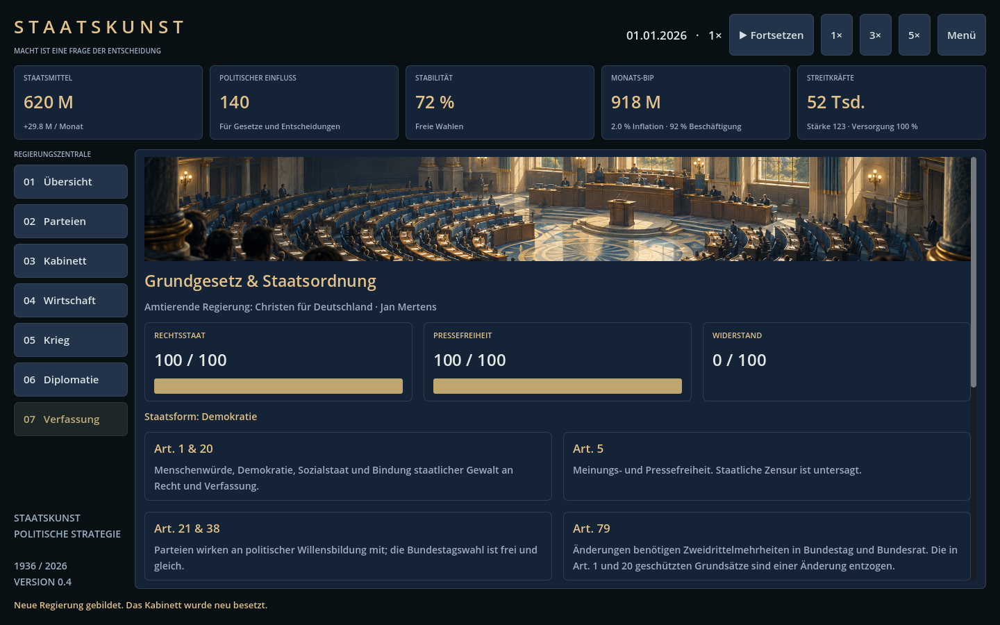

# Version 0.4 — Bilder, CfD, Grundgesetz und Wirtschaftsreparaturen

## Christen für Deutschland

**Christen für Deutschland (CfD)** ist eine ausdrücklich fiktive Partei. Die realen Parteien bleiben erhalten. Die CfD startet 2026 in der Opposition; 1936 ist sie ein fiktiver Alternativpfad nach Einführung einer demokratischen Verfassung.

| Spielfigur | Spielprofil |
|---|---|
| Jan Mertens | Parteiführung / Außenpolitik |
| Clara Winter | Finanzen |
| Tobias Falk | Wirtschaft |
| Miriam Seidel | Verteidigung |
| Lukas Ahrens | Außenpolitik |
| Elisabeth Voss | Finanzen |

Alle sechs Namen, Parteifunktionen und Porträts sind für das Spiel erfunden. In einer CfD-geführten Regierung werden ihre eigenen Kandidaten bei der automatischen Kabinettsbesetzung bevorzugt. Ämter lassen sich weiterhin manuell ändern. Der Parteibereich zeigt Porträts und ein eigenes Emblem; der Kabinettsbereich zeigt die entsprechenden Porträts nach einer Ernennung. Hinzu kommt eine Parlamentsillustration. [Bilddateien, Erzeugungsweise und vollständige Prompts](ART.md).

## Grundgesetz und alternativer Machtpfad

Der siebte Bereich **Verfassung** zeigt Rechtsstaat, Pressefreiheit und Widerstand. Deutschland 2026 erhält ein Grundgesetz-Panel mit Zusammenfassungen der Artikel 1, 5, 20, 21, 38 und 79. Das Grundgesetz wird im 1936-Szenario nicht rückwirkend verwendet.

Die Abschaffung der demokratischen Grundsätze wird im Spiel ausdrücklich als **Verfassungsbruch** behandelt. Artikel 79 Absatz 3 schützt unter anderem die Grundsätze aus Artikel 1 und 20 vor Verfassungsänderungen. Eine parlamentarische Mehrheit allein legalisiert ihre Abschaffung nicht. [Grundgesetz, Artikel 79](https://www.gesetze-im-internet.de/gg/art_79.html), [Artikel 20](https://www.gesetze-im-internet.de/gg/art_20.html).

Spielablauf:

1. Unter **Parteien** eine andere Partei als die Startpartei an die Regierung bringen, beispielsweise AfD oder CfD. Dazu Wahlkampf führen, eine Mehrheitskoalition bilden und die Regierungsführung wechseln. Keine Partei löst automatisch eine Diktatur aus.
2. Nach mindestens **15 Tagen** Amtszeit und mit einer Koalitionsmehrheit kann die Regierung für **100 Einfluss** eine Verfassungskrise auslösen. Rechtsstaatlichkeit fällt auf 65, Stabilität um acht Punkte; Widerstand entsteht.
3. Mindestens **30 Tage** später kann für **100 Einfluss** die Machtzentralisierung erfolgen. Rechtsstaat und Pressefreiheit sinken auf 35, Stabilität um zehn Punkte.
4. Nach weiteren **30 Tagen**, mit mindestens **30 % Parteizustimmung** und **150 Einfluss**, kann eine Diktatur ausgerufen werden. Freie Wahlen und Wahlkampf enden, der Regierungschef wird Staatsführer. Stabilität sinkt um zwölf Punkte, Widerstand steigt weiter.

Die Schritte haben eine ausdrückliche Bestätigung im Spiel. Die Wartezeiten ersetzen die jeweiligen Einflusskosten nicht. Ein Regierungswechsel zu einer anderen Partei beendet eine laufende Krise. Vor Errichtung der Diktatur kann **Verfassung verteidigen** für 60 Einfluss die demokratischen Institutionen wiederherstellen. Danach führt **Demokratische Verfassung** zurück zu freien Wahlen.

Institutioneller Abbau senkt Wirtschaftsleistung, erhöht Kreditrisiken und verursacht zusätzliche laufende Ausgaben. Widerstand belastet die Stabilität. Es gibt keine taktischen Putsch- oder Gewalteinheiten. Schwellen, Koalitionsanteile und Zeitabläufe sind abstrakte Spielregeln, keine Nachbildung realer Verfassungsverfahren.

## Konkrete Wirtschaftsreparaturen

- **Eine gemeinsame Güterberechnung:** Produktionsanzeige, tatsächliche Produktion, Verbrauch und Fehlmengen verwenden dieselbe Tagesplanung. Materialproduktion berücksichtigt die verfügbare Energie. Kriegsschäden werden in der Materialproduktion nicht doppelt angewendet.
- **Handel im Saldo:** Importe und Exporte stehen in der Einnahmen-/Ausgabenübersicht und im laufenden Monatssaldo. Die Handelsrate basiert auf der letzten tatsächlichen Lieferung; bei einem neuen Vertrag erscheint sie nach dem ersten Tageswechsel. Lieferfähigkeit und Krieg können sie verändern.
- **Kontobuch:** Einmalige Projektkosten, Kredite, Tilgung und Tagesabschlüsse sind sichtbar. Automatische Defizitfinanzierung wird als Kredit ausgewiesen. Der Tagesabschluss enthält Betriebshaushalt, tatsächlichen Handel und Finanzierung; separate Entscheidungen bleiben eigene Buchungen.
- **Budgetvorschau:** Steuer- und Budgetknöpfe zeigen die unmittelbare Veränderung des Monatssaldos vor dem Beschluss. Investitionen werden sofort bezahlt; neue Kapazität entsteht nach Bauabschluss.
- **Kündbare Verträge:** Eigene Importverträge können kostenlos gekündigt werden. Doppelte Verträge für denselben Partner und dasselbe Gut werden verhindert. Andere Spieler können fremde Verträge nicht kündigen.
- **Bessere Versorgungsanzeigen:** Produktion, Bedarf, Nettobilanz, ungedeckter Bedarf und die voraussichtliche Zeit bis zur Erschöpfung des Vorrats werden getrennt gezeigt.
- **KI reagiert auf Mangel:** Sie priorisiert Energie und Landwirtschaft bei sinkenden Vorräten und erweitert ihre Armee nicht bei einem zu kleinen laufenden Überschuss.
- **Kriegsabrechnung:** Die im Kriegsbericht kumulierten Kosten stammen direkt aus der täglichen Haushaltsabrechnung.

Zeit startet weiterhin pausiert. Sofortige Entscheidungen buchen direkt; Produktion, Handel, Baufortschritt und laufender Haushalt benötigen Spielzeit. Das Wirtschaftsmodell ist vereinfacht und nicht an amtlichen volkswirtschaftlichen Daten kalibriert.

## Spielstände und Tests

Version 0.4 speichert in **campaign-v4.json**. Ältere Dateien bleiben erhalten und werden nicht überschrieben; aufgrund neuer Parteidaten, Verfassungszustände und Wirtschaftsaufzeichnungen werden sie nicht automatisch geladen.

425 Simulationsprüfungen, 41 zusätzliche Verfassungs-/Wirtschaftsregressionen und 80 Oberflächenprüfungen bestanden. Beide Epochen mit zwei ENet-Prozessen geprüft, einschließlich serverseitiger Ablehnung einer Diktatur ohne Voraussetzungen. Details im [Prüfbericht](VALIDATION.md).
